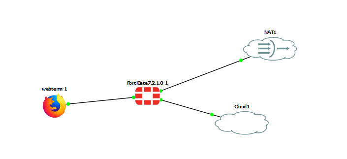
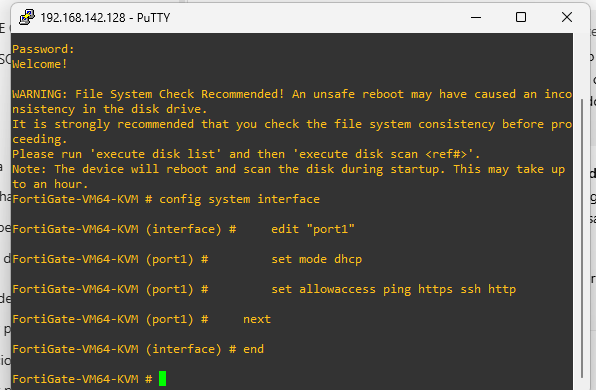
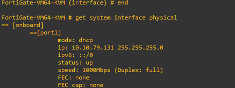
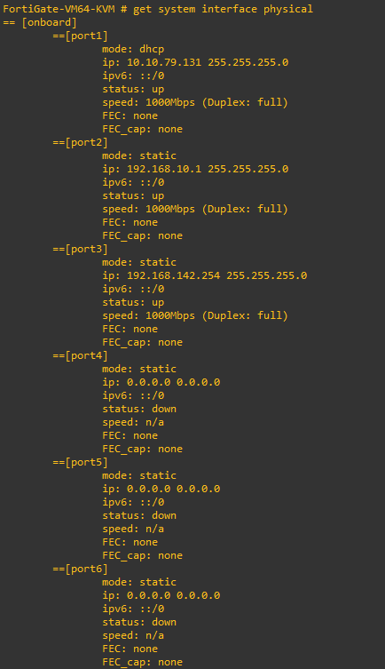
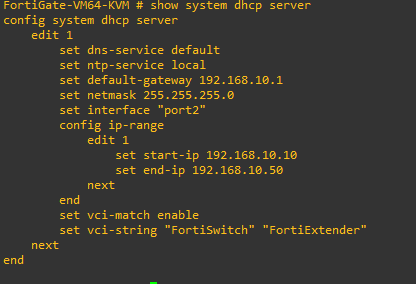
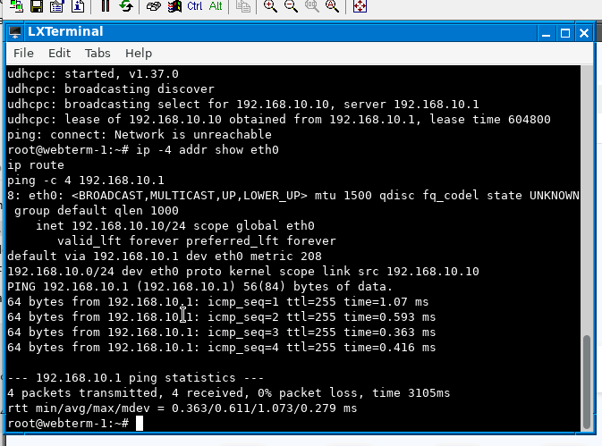
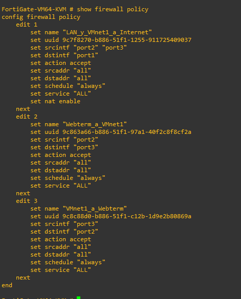
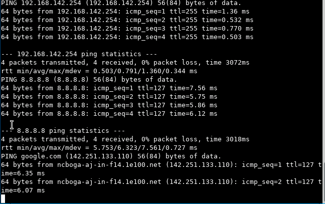
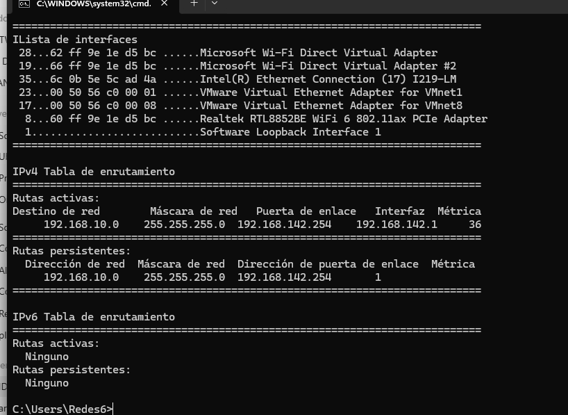
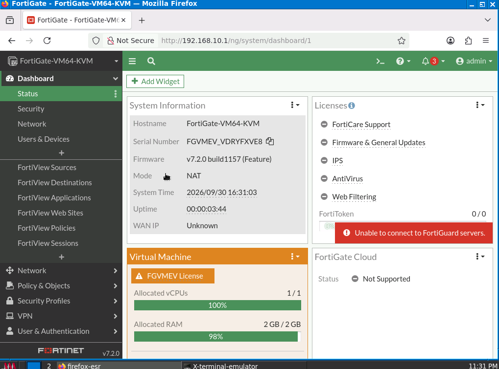

# Laboratorio básico de FortiGate con VMnet1

**Estudiante:** Julián Camilo Moreno Valderrama  
**Herramientas:** GNS3, GNS3 VM, VMware Workstation, FortiGate y Webterm.

## Objetivo

Conectar Webterm a Internet mediante FortiGate y comunicarlo con la red virtual VMnet1. En este equipo, VMnet1 utiliza `192.168.142.0/24`; por eso se adaptaron a esa red las direcciones del enunciado.

## 1. Topología

En el proyecto **Juli2** se conectaron tres interfaces del FortiGate:

| Interfaz | Conexión | Función |
| --- | --- | --- |
| `port1` | NAT de GNS3 | Salida a Internet mediante DHCP |
| `port2` | Webterm | Red interna `192.168.10.0/24` |
| `port3` | Cloud conectado a VMnet1 | Red virtual `192.168.142.0/24` |



La captura muestra los enlaces de los tres nodos en verde. El nodo Cloud utiliza el adaptador **VMware Network Adapter VMnet1**.

## 2. Configuración de la conexión a Internet

Se configuró `port1` en modo DHCP para que el FortiGate recibiera automáticamente una dirección desde el nodo NAT de GNS3. También se habilitó el acceso por ping, HTTPS, SSH y HTTP.

```text
config system interface
    edit "port1"
        set mode dhcp
        set allowaccess ping https ssh http
    next
end
```



Después se verificó el estado de las interfaces. `port1` recibió la dirección `10.10.79.131/24` desde la red NAT y quedó activa.

```text
get system interface physical
```



## 3. Configuración de las redes internas

Se configuró `port2` como puerta de enlace de Webterm y `port3` como conexión hacia VMnet1.

```text
config system interface
    edit "port2"
        set mode static
        set ip 192.168.10.1 255.255.255.0
        set allowaccess ping https ssh http
    next
    edit "port3"
        set mode static
        set ip 192.168.142.2 255.255.255.0
        set allowaccess ping https ssh http
    next
end
```

Al consultar las interfaces se comprobó que `port1`, `port2` y `port3` estaban activas.



## 4. Servidor DHCP para Webterm

Se habilitó un servidor DHCP en `port2`. El rango disponible para Webterm quedó entre `192.168.10.10` y `192.168.10.50`, con el FortiGate como puerta de enlace.

```text
config system dhcp server
    edit 1
        set interface "port2"
        set default-gateway 192.168.10.1
        set netmask 255.255.255.0
        set dns-service default
        config ip-range
            edit 1
                set start-ip 192.168.10.10
                set end-ip 192.168.10.50
            next
        end
    next
end
```



## 5. Prueba de Webterm en la red LAN

Webterm recibió por DHCP la dirección `192.168.10.10/24`. La puerta de enlace configurada fue `192.168.10.1`, correspondiente a `port2` del FortiGate.

Para solicitar la dirección se utilizó el cliente DHCP incluido en el nodo:

```bash
/gns3/bin/busybox udhcpc -i eth0 -s /gns3/etc/udhcpc/default.script -q -n
```

Luego se verificó la dirección, la ruta y la comunicación con el FortiGate.

```bash
ip -4 addr show eth0
ip route
ping -c 4 192.168.10.1
```



## 6. Políticas de firewall

Se crearon tres políticas: una para la salida a Internet desde las redes internas y dos para permitir la comunicación entre Webterm y VMnet1.

```text
config firewall policy
    edit 1
        set name "LAN_y_VMnet1_a_Internet"
        set srcintf "port2" "port3"
        set dstintf "port1"
        set srcaddr "all"
        set dstaddr "all"
        set action accept
        set schedule "always"
        set service "ALL"
        set nat enable
    next
    edit 2
        set name "Webterm_a_VMnet1"
        set srcintf "port2"
        set dstintf "port3"
        set srcaddr "all"
        set dstaddr "all"
        set action accept
        set schedule "always"
        set service "ALL"
    next
    edit 3
        set name "VMnet1_a_Webterm"
        set srcintf "port3"
        set dstintf "port2"
        set srcaddr "all"
        set dstaddr "all"
        set action accept
        set schedule "always"
        set service "ALL"
    next
end
```



## 7. Validación de conectividad

Desde Webterm se comprobó la comunicación con la interfaz de VMnet1 del FortiGate, la salida a Internet y la resolución DNS.

```bash
ping -c 4 192.168.142.2
ping -c 4 8.8.8.8
ping -4 -c 4 google.com
```



## 8. Ruta de retorno en Windows

El adaptador VMnet1 del equipo anfitrión usa `192.168.142.1`. Se agregó una ruta persistente para que Windows sepa que la red de Webterm (`192.168.10.0/24`) se alcanza por el FortiGate (`192.168.142.2`).

```cmd
route -p add 192.168.10.0 mask 255.255.255.0 192.168.142.2
```



## 9. Acceso a la interfaz gráfica

Desde el navegador de Webterm se ingresó a `http://192.168.10.1`. Después de iniciar sesión se mostró el panel principal del FortiGate, confirmando que la administración web estaba disponible.


