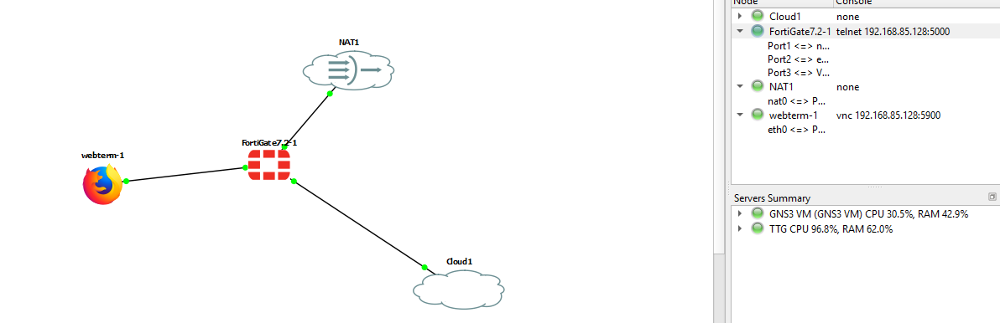

# Laboratorio básico sobre VMWARE

Ejercicio en clase donde los dispositivos del laboratorio (como máquinas virtuales adicionales, servidores o el propio anfitrión) se encuentran vinculados a **VMnet1** (`192.168.85.0/24`), la topología debe modificarse para que el FortiGate actúe como enrutador/firewall entre esa red existente y el nodo Webterm, o bien integrarse directamente con ella y utilizar la nube NAT de GNS3 para la salida al exterior.




---

### Esquema de la Topología y Segmentación

```text
       [ Nube NAT (GNS3) ]
               │
        (port1 - DHCP/WAN)
         [ FortiGate ]
   (port2 - LAN)      (port3 - VMnet1)
         │                     │
    [ Webterm ]       [ Nube Cloud / VMnet1 ]
 (192.168.10.0/24)        (192.168.85.0/24)
                           ├── Host Anfitrión (192.168.85.1)
                           └── Zabbix / Otros VMs

```

* **`port1`:** WAN conectada al nodo **NAT** de GNS3 para proveer salida directa a Internet.
* **`port2`:** LAN interna dedicada para **Webterm** (`192.168.10.0/24`).
* **`port3`:** Enlace a **VMnet1** (`192.168.85.0/24`) a través de un nodo de tipo **Cloud**.

---

### Paso 1: Configurar el nodo Cloud para VMnet1 en GNS3

1. Arrastrar un nodo **Cloud** al área de trabajo.
2. Hacer clic derecho sobre el nodo Cloud -> **Configure**.
3. En la pestaña **Ethernet interfaces**:
* Desmarcar las interfaces innecesarias.
* Seleccionar o agregar la interfaz correspondiente al adaptador del host: **`VMware Network Adapter VMnet1`**.
* Aplicar los cambios y pulsar **OK**.


---

### Paso 2: Conexión física de los nodos

1. Conectar **NAT** (`nat0`) hacia **`port1`** del FortiGate.
2. Conectar el nodo **Cloud** (interfaz de `VMnet1`) hacia **`port3`** del FortiGate.
3. Conectar **Webterm** (`eth0`) hacia **`port2`** del FortiGate.
4. Iniciar todos los nodos (**Start**).

---

### Paso 3: Configuración del FortiGate (CLI)

Ingresar a la consola del FortiGate (`admin`, sin contraseña inicial o la definida previamente):

#### 3.1 Configurar WAN (`port1`) para recibir Internet

```fortios
config system interface
    edit "port1"
        set mode dhcp
        set allowaccess ping https ssh http
    next
end

```

#### 3.2 Configurar la interfaz conectada a VMnet1 (`port3`)

Se asigna una dirección IP estática libre dentro del segmento `192.168.85.0/24` (por ejemplo, `192.168.85.254`):

```fortios
config system interface
    edit "port3"
        set ip 192.168.85.254 255.255.255.0
        set allowaccess ping https ssh http
    next
end

```

#### 3.3 Configurar la interfaz del Webterm (`port2`) y su servidor DHCP

```fortios
config system interface
    edit "port2"
        set ip 192.168.10.1 255.255.255.0
        set allowaccess ping https ssh http
    next
end

config system dhcp server
    edit 1
        set default-gateway 192.168.10.1
        set netmask 255.255.255.0
        set interface "port2"
        config ip-range
            edit 1
                set start-ip 192.168.10.10
                set end-ip 192.168.10.50
            next
        end
        set dns-service default
    next
end

```

#### 3.4 Configuración del Enrutamiento y Políticas de Firewall

Se deben habilitar las políticas necesarias para:

1. Dar salida a Internet a Webterm y VMnet1.
2. Permitir el tráfico bidireccional entre Webterm (`port2`) y los dispositivos de VMnet1 (`port3`).

```fortios
config firewall policy
    edit 1
        set name "LAN_to_Internet"
        set srcintf "port2" "port3"
        set dstintf "port1"
        set srcaddr "all"
        set dstaddr "all"
        set action accept
        set schedule "always"
        set service "ALL"
        set nat enable
    next
    edit 2
        set name "Webterm_to_VMnet1"
        set srcintf "port2"
        set dstintf "port3"
        set srcaddr "all"
        set dstaddr "all"
        set action accept
        set schedule "always"
        set service "ALL"
    next
    edit 3
        set name "VMnet1_to_Webterm"
        set srcintf "port3"
        set dstintf "port2"
        set srcaddr "all"
        set dstaddr "all"
        set action accept
        set schedule "always"
        set service "ALL"
    next
end

```

---

### Paso 4: Enrutamiento en las máquinas de VMnet1 (Zabbix, Host, etc.)

Para que los equipos que residen en `VMnet1` puedan responderle al Webterm (`192.168.10.0/24`), necesitan saber cómo alcanzar esa subred:

* **Opción A (En máquinas virtuales como Zabbix / Linux en VMnet1):**
Definir la ruta estática hacia la red del Webterm apuntando al FortiGate:
```bash
sudo ip route add 192.168.10.0/24 via 192.168.85.254

```


*(O configurar `192.168.85.254` como su Default Gateway).*
* **Opción B (En la máquina física anfitriona Windows):**
Si se desea acceder a Webterm desde el navegador del PC físico:
```cmd
route add 192.168.10.0 mask 255.255.255.0 192.168.85.254

```


---

### Paso 5: Configuración y Validación en Webterm

1. Editar la configuración de red de **Webterm** (clic derecho -> **Edit network config**) asegurando:
```text
auto eth0
iface eth0 inet dhcp

```


2. Iniciar el nodo Webterm y abrir su consola.
3. **Pruebas de conectividad:**
* **Hacia el FortiGate:** `ping 192.168.10.1` y `ping 192.168.85.254`.
* **Hacia los equipos en VMnet1:** `ping 192.168.85.X` (donde `X` es la IP del anfitrión o de la máquina Zabbix).
* **Hacia Internet (IP y DNS):** `ping 8.8.8.8` y `ping google.com`.
* **Navegación:** Abrir Firefox dentro de Webterm para navegar a Internet y gestionar el FortiGate vía web (`[https://192.168.10.1](https://192.168.10.1)` o `[https://192.168.85.254](https://192.168.85.254)`).

