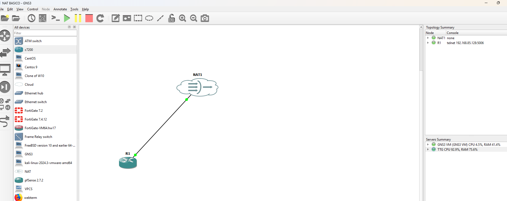
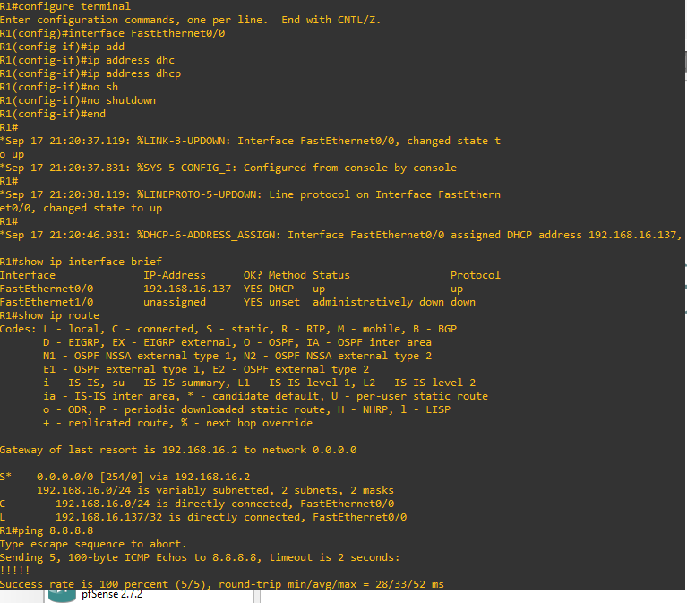

# Manual de Laboratorio: Conectividad Externa en GNS3 mediante Nube Bridged y Nube NAT

Este manual describe el procedimiento para proporcionar conectividad de red y salida a Internet a un enrutador Cisco IOS en GNS3 VM utilizando VMware Workstation. Se presentan las dos metodologías de integración de capa de red: el modo puente directo (**Bridged**) y el modo con traducción de direcciones de red (**NAT**).

---


## 1. Fundamentos: Tipos de Red Virtual en VMware Workstation

Para comprender el comportamiento de los laboratorios en GNS3, es indispensable diferenciar los tres tipos de conmutadores virtuales estándar que administra VMware:

| Tipo de Red | Identificador | Comportamiento y Segmento | Acceso Externo |
| --- | --- | --- | --- |
| **Bridged** (En puente) | `VMnet0` | Enlaza la interfaz virtual directamente a una tarjeta física (Ethernet/Wi-Fi). La máquina virtual o nodo virtual comparte el espacio de direccionamiento real de la LAN física (ej. `192.168.1.0/24`). | Directo y bidireccional en la LAN física e Internet. |
| **Host-Only** (Solo host) | `VMnet1` | Crea una red aislada y privada exclusivamente entre el sistema anfitrión (Windows) y la máquina virtual (ej. `192.168.85.0/24`). | Aislada. No tiene salida a Internet ni visibilidad externa. |
| **NAT** | `VMnet8` | VMware actúa como servidor DHCP y enrutador intermedio con enmascaramiento PAT/NAT (ej. `192.168.16.0/24`). El anfitrión comparte su IP pública/física. | Salida hacia Internet permitida; el tráfico entrante no solicitado desde la LAN física queda bloqueado. |

---

## 2. Método A: Conexión mediante Nodo Cloud en Modo Puente (Bridged)

El modo puente integra el enrutador virtual directamente en el conmutador o punto de acceso de la red física. El enrutador solicitará una dirección IP directamente al router/servidor DHCP del hogar u oficina.

### Fase A.1: Configuración en VMware Workstation

1. Se abre VMware Workstation y se navega a **Edit > Virtual Network Editor...**.
2. Se hace clic en **Change Settings** para obtener privilegios de Administrador.
3. Se selecciona el conmutador **VMnet0**.
4. En **VMnet Information**, se marca **Bridged (connect VMs directly to the external network)**.
5. En el campo desplegable **Bridged to:**, se selecciona explícitamente la tarjeta de red física (ejemplo: *Realtek PCIe GbE Family Controller*). **Evitar la opción "Automatic"**.
6. Se pulsa **Apply** y luego **OK**.

7. Con la **GNS3 VM** apagada, se accede a **Edit virtual machine settings**.
8. Se selecciona el adaptador de red principal y se marca **Personalizado: red virtual específica > VMnet0 (En puente)**.
9. Se inicia la **GNS3 VM**.

> **Nota sobre adaptadores Wi-Fi:** El estándar 802.11 rechaza múltiples direcciones MAC virtuales sobre una sola trama inalámbrica física en modo promiscuo. Si el equipo anfitrión opera por Wi-Fi, la asignación DHCP en modo Bridged fallará o presentará inestabilidad; se recomienda usar conexión física por cable Ethernet o recurrir al Método B (NAT).

### Fase A.2: Configuración del nodo Cloud en GNS3

1. Se arrastra el nodo **Cloud** al lienzo seleccionando como nodo de ejecución la **GNS3 VM**.
2. Se hace clic derecho sobre el nodo **Cloud** y se selecciona **Configure**.
3. En la pestaña **Ethernet interfaces**, se confirma la existencia del adaptador de red enlazado (habitualmente `eth0`).
4. Con la herramienta de cableado, se conecta el puerto `eth0` de la nube hacia la interfaz `FastEthernet0/0` del enrutador **R1**.

### Fase A.3: Configuración y Validación en Cisco IOS (R1)

Se configuran los parámetros de interfaz en la consola del enrutador:

```text
R1# configure terminal
R1(config)# interface FastEthernet0/0
R1(config-if)# ip address dhcp
R1(config-if)# no shutdown
R1(config-if)# end

```

**Verificación:**

* La consola debe reportar el mensaje del sistema:
`%DHCP-6-ADDRESS_ASSIGN: Interface FastEthernet0/0 assigned DHCP address 192.168.1.X...`
* Se comprueba la tabla de interfaces y la conectividad:
```text
R1# show ip interface brief
R1# show ip route
R1# ping 192.168.1.1

```


---

## 3. Método B: Conexión mediante Nodo NAT (Recomendado para Wi-Fi y Salida Rápida)

El nodo **NAT** conecta el entorno de GNS3 a la interfaz `VMnet8` de VMware. No requiere modificar conmutadores físicos ni depende de la compatibilidad de la tarjeta inalámbrica.






### Fase B.1: Verificación del adaptador NAT en la GNS3 VM

1. En VMware Workstation, en los ajustes de la **GNS3 VM** (*Edit virtual machine settings*), se comprueba que el segundo adaptador de red (*Network Adapter 2*) esté configurado en modo **NAT**.
2. En el **Virtual Network Editor**, se valida que **VMnet8** tenga activo el servicio DHCP local (ejemplo: segmento `192.168.16.0/24`).

### Fase B.2: Inserción del nodo NAT en GNS3

1. En el panel izquierdo de dispositivos de GNS3, se localiza el elemento denominado **NAT** (icono de nube con símbolo de firewall/traducción).
2. Se arrastra hacia el área de trabajo, seleccionando como servidor de ejecución la **GNS3 VM**.
3. Se selecciona la herramienta de cableado y se enlaza el puerto **nat0** del nodo NAT hacia la interfaz **FastEthernet0/0** de **R1**.

### Fase B.3: Configuración y Validación en Cisco IOS (R1)

Se activa la interfaz para solicitar los parámetros de red mediante DHCP:

```text
R1# configure terminal
R1(config)# interface FastEthernet0/0
R1(config-if)# ip address dhcp
R1(config-if)# no shutdown
R1(config-if)# end

```

**Verificación:**

* La consola mostrará la asignación dinámica en el segmento virtual:
`%DHCP-6-ADDRESS_ASSIGN: Interface FastEthernet0/0 assigned DHCP address 192.168.16.X...`
* Se evalúa la resolución de salida hacia la puerta de enlace virtual y servidores DNS públicos:
```text
R1# show ip interface brief
R1# show ip route
R1# ping 8.8.8.8

```


*(La prueba debe registrar una tasa de éxito de cuatro o cinco signos de exclamación: `!!!!!`).*

---

## 4. Cuadro Comparativo para Selección de Método

* **Se debe utilizar Cloud (Bridged)** cuando se requiera que dispositivos externos físicos (otra PC, un servidor físico de la LAN o un switch de hardware) alcancen directamente la IP del enrutador virtual de GNS3 sin configurar mapeos de puertos, siempre sobre conexión física cableada.
* **Se debe utilizar NAT** para prácticas individuales, cuando el host anfitrión esté conectado por Wi-Fi, o cuando solo se requiera que el laboratorio descargue paquetes, navegue por Internet o consulte servicios externos sin exponerse a la red física local.
