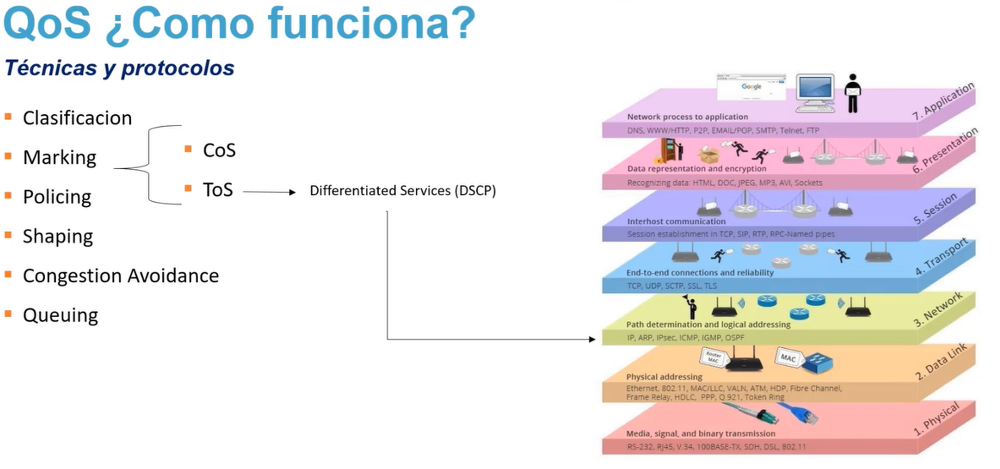
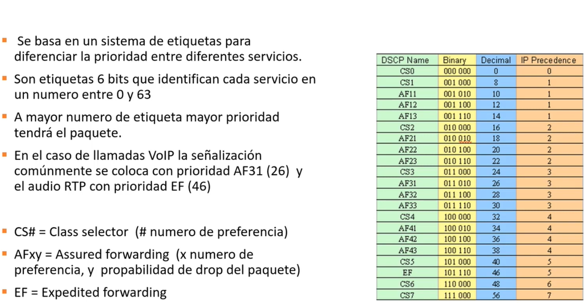

## Calidad de Servicio (QoS) en Redes
La Calidad de Servicio (QoS) es un conjunto de tecnologías y mecanismos diseñados para administrar el ancho de banda y priorizar el tráfico crítico sobre el tráfico menos importante. Esto garantiza que aplicaciones sensibles al tiempo (como la voz sobre IP o el video en vivo) funcionen sin interrupciones ni retrasos, incluso cuando la red está saturada.

# Capas del Modelo OSI relacionadas con QoS

- **Capa 3 (Network):** Es donde opera DSCP / ToS. Permite que los routers identifiquen la prioridad del tráfico (como voz o video) y apliquen políticas de QoS a lo largo de toda la red.

- **Capa 2 (Data Link):** Es donde opera CoS (Class of Service) mediante el estándar IEEE 802.1p. La prioridad se maneja solo dentro de la red local (LAN) usando marcos de Ethernet.

------------------------------
## 1. El Flujo de Trabajo de QoS (Paso a Paso)
Para implementar QoS, los paquetes de datos pasan por una serie de etapas secuenciales dentro de los dispositivos de red (como routers y switches):

[ Tráfico ] ➔ [ 1. Clasificación ] ➔ [ 2. Marcado ] ➔ [ 3. Control (Policing/Shaping) ] ➔ [ 4. Encolado ] ➔ [ Salida ]

# Técnicas y Mecanismos de QoS

• **Clasificación:** Identifica y organiza el tráfico de red según su tipo (voz, video, datos).
• **Marking (Marcado):** Modifica los encabezados de los paquetes para asignarles prioridad. Utiliza CoS (Capa 2) o ToS (Capa 3).
• **DSCP (Differentiated Services):** Evolución del campo ToS que opera en la Capa 3 (Network) para clasificar el tráfico a nivel de red IP.
• **Policing:** Limita el ancho de banda descartando el tráfico que excede el límite permitido.
• **Shaping:** Modera el tráfico reteniendo los excesos en una cola para suavizar las ráfagas de datos.
• **Congestion Avoidance:** Previene el colapso de la red descartando paquetes de forma preventiva antes de que las colas se llenen (ej. WRED).
• **Queuing (Encolado):** Administra el orden en que los paquetes salen del router basándose en su prioridad (ej. FIFO, WFQ).

# Proceso.

## 1. Clasificación

* Qué hace: Identifica el tipo de tráfico que entra al equipo.
* Cómo lo hace: Inspecciona las direcciones IP, los puertos (como el puerto 443 para HTTPS), o la aplicación de origen.
* Analogía: En un aeropuerto, es el momento en que se separa a los pasajeros según su tipo de boleto (Primera clase, Business, Turista).

## 2. Marcado (Marking)

* Qué hace: "Pinta" o añade una etiqueta al encabezado del paquete para que los siguientes routers sepan su prioridad de inmediato sin volver a analizarlo.
* Mecanismos clave:
* CoS (Class of Service): Marcado en la Capa 2 (Enlace de datos), usado en redes locales (Ethernet/802.1Q).
   * ToS / DSCP (Differentiated Services Code Point): Marcado en la Capa 3 (Red). Como muestra la imagen, el DSCP utiliza el campo ToS de la cabecera IP para ofrecer una clasificación más avanzada y granular a nivel global de internet.

## 3. Control de Tráfico: Policing vs. Shaping
Cuando el tráfico supera el ancho de banda contratado o asignado, se aplican dos técnicas para contenerlo:

| Característica | Policing (Regulación) | Shaping (Modelado) |
|---|---|---|
| Acción inmediata | Descarta los paquetes en exceso de forma abrupta. | Retiene los paquetes en una cola temporal de memoria. |
| Efecto en el tráfico | Genera ráfagas cortadas. Causa retransmisiones. | Suaviza el tráfico, creando un flujo constante y fluido. |
| Uso ideal | Tráfico de datos donde no importa perder paquetes momentáneamente. | Tráfico de voz o video que no tolera caídas drásticas de rendimiento. |

## 4. Evitación de Congestión (Congestion Avoidance)

* Qué hace: Monitorea las colas de memoria del router. Si detecta que están a punto de llenarse, empieza a descartar paquetes no prioritarios de forma preventiva (usando algoritmos como WRED) para evitar que la red se sature por completo.

## 5. Gestión de Colas (Queuing)

* Qué hace: Administra cómo salen los paquetes del router hacia su destino.
* Mecanismos: Crea "carriles" virtuales. Los paquetes con marcado de alta prioridad (como la voz) saltan al inicio de la fila, mientras que los correos electrónicos o descargas esperan su turno.

------------------------------
## 2. Ejemplo Práctico: Escenario Corporativo
Imagina una oficina con un enlace de internet de 100 Mbps donde conviven tres actividades al mismo tiempo:

   1. Llamadas de Voz (VoIP): Sensibles al retraso (jitter y latencia). Requieren solo 2 Mbps, pero constantes.
   2. Videoconferencias (Teams/Zoom): Consumen bastante ancho de banda (20 Mbps) y requieren fluidez.
   3. Descargas de archivos y navegación web: Pueden esperar sin afectar la experiencia del usuario.

## Configuración de la Estrategia de QoS:

                  ┌── Clase Alta Prioridad (Voz) ──────➔ Garantizar 5 Mbps (Baja Latencia)
                  │
[ Tráfico Mixto ] ┼── Clase Media Prioridad (Video) ───➔ Garantizar 30 Mbps (Shaping suave)
                  │
                  └── Clase Por Defecto (Web/Email) ───➔ Ancho de banda restante (Policing si supera límite)

   1. Clasificación y Marcado:
   * Todo paquete que provenga de los teléfonos IP se clasifica como Voz y se le asigna una etiqueta DSCP EF (Expedited Forwarding), que es la máxima prioridad.
      * El tráfico de Zoom se marca como DSCP AF41 (Assured Forwarding).
   2. Aplicación de Políticas (Shaping/Policing):
   * Al tráfico de descargas masivas se le aplica Policing a un máximo de 40 Mbps para asegurar que nunca ahogue las llamadas ni los videos.
   3. Encolado (Queuing):
   * El router de salida habilita una cola de baja latencia (LLQ). Cada vez que llega un paquete marcado con DSCP EF (Voz), el router detiene momentáneamente los demás envíos para despachar ese paquete de forma inmediata.
   

- REFERENCIAS:

-  https://kodiakk.hashnode.dev/qos-que-es-por-que-tecnica-de-marcado-y-dscp