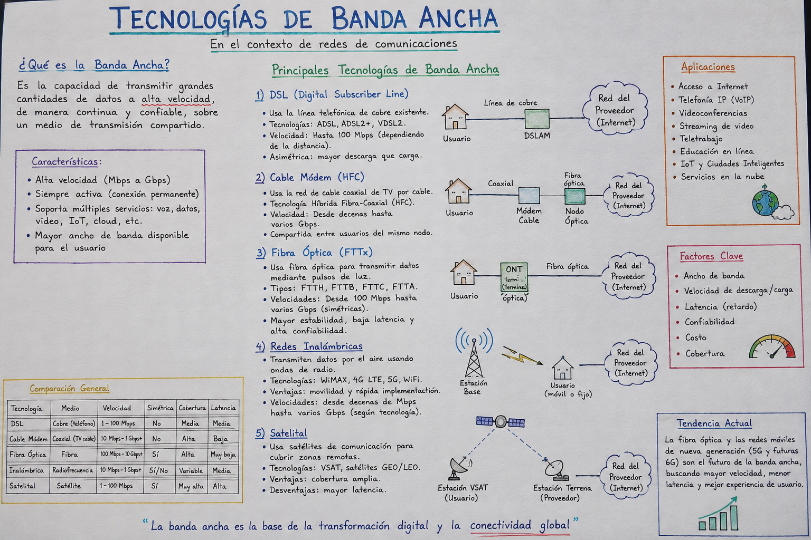

# Banda Ancha 

Repositorio curso ***Banda Ancha**  2026-2, universidad Militar Nueva Granada.

---

# Referencias:

- https://ccnadesdecero.es/descargar-cisco-ios-gns3/
- https://www.telectronika.com/descargas/cisco-imagenes-ios-para-gns3-dynamips-y-vm/
- https://proyectoa.com/agregar-switch-router-cisco-c3725-a-proyecto-gns3-y-configuracion-inicial/
- https://youtu.be/gWPcRmemD0g?si=rfQ-xZ87ogiuofM8
- https://youtu.be/_Y7hNF86wes?si=MgKDE75eruLpvIro
