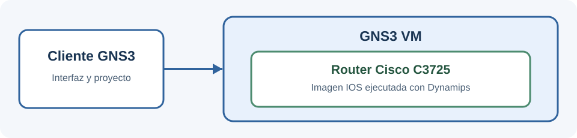

# Taller en clase: C3725 en la GNS3 VM

**Estudiante:** Julián Camilo Moreno Valderrama

## Objetivo

Crear un template de router Cisco C3725 y ejecutarlo en la **GNS3 VM**, no en el servidor local. Esta práctica deja preparada la MV para trabajar después con appliances como FortiGate.



## 1. Preparación del entorno

Usé GNS3 y VMware Workstation. Al abrir GNS3 y el proyecto, la GNS3 VM `Juli11` se inicia automáticamente. Antes de poner en marcha el router, comprobé que la MV estuviera encendida y conectada. Si la conexión falla, se puede revisar en **Help → Setup Wizard**.

El cliente GNS3 muestra la versión **2.2.61**:


En VMware, la pantalla de la MV muestra **GNS3 server version: 2.2.61**. Por tanto, cliente y servidor coinciden. La línea **VM version: 0.21.0** identifica una versión distinta del sistema de la MV.


## 2. Creación del template C3725

1. Descargué la imagen IOS `c3725-adventerprisek9-mz.124-15.T14.image` para esta práctica.
2. En GNS3 abrí **Edit → Preferences → Dynamips → IOS routers → New** e importé esa imagen.
3. Seleccioné **GNS3 VM** como servidor del template y confirmé la plataforma **c3725**. La ventana de propiedades muestra ambos datos; el template se llama `Cisco 3725 124-15.T14`.


4. Configuré **256 MiB de RAM**, cantidad indicada para esta versión de IOS, y el adaptador base `GT96100-FE`. El valor Idle-PC quedó en `0x60c09aa0` para reducir el consumo de CPU.


5. Guardé el template y comprobé que apareciera entre los routers disponibles.


## 3. Prueba de funcionamiento

Creé el proyecto `Taller_C3725_JulianMoreno`, añadí el router `R1` y lo inicié. El indicador verde confirma que está encendido. En la configuración del proyecto, `R1` está asignado a la GNS3 VM.


En la consola ejecuté:

```text
R1#show version
```

La salida identifica el modelo **Cisco 3725** y el IOS **12.4(15)T14**. También informa dos interfaces FastEthernet y aproximadamente 256 MB de memoria.


Después comprobé las interfaces:

```text
R1#show ip interface brief
Interface              IP-Address      OK? Method Status                Protocol
FastEthernet0/0        unassigned      YES unset  administratively down down
FastEthernet0/1        unassigned      YES unset  administratively down down
R1#
```

Las interfaces aparecen sin IP y administrativamente deshabilitadas porque todavía no se configuró una red. Esto no impide comprobar que el IOS arrancó y que el router está disponible.


## Resultado

| Comprobación | Evidencia |
| --- | --- |
| Cliente y servidor GNS3 en versión 2.2.61 | Capturas de **About** y de la GNS3 VM |
| Template C3725 alojado en la GNS3 VM | Propiedades del template y proyecto |
| Imagen IOS 12.4(15)T14, RAM de 256 MiB | Propiedades y `show version` |
| Router `R1` encendido | Topología y consola |
| Dos interfaces FastEthernet detectadas | `show ip interface brief` |

**Nota:** el archivo de FortiGate proporcionado para la práctica posterior no se utilizó para crear este router. La imagen IOS se empleó en GNS3 y no se incluye en el repositorio.

## Referencias

- [GNS3: configuración con la GNS3 VM](https://docs.gns3.com/docs/getting-started/setup-wizard-gns3-vm)
- [GNS3: imágenes IOS para Dynamips y requisitos del C3725](https://docs.gns3.com/docs/emulators/cisco-ios-images-for-dynamips#c3725)
