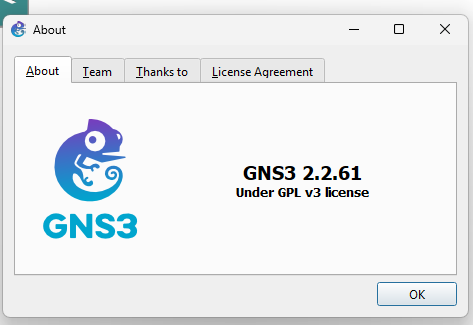
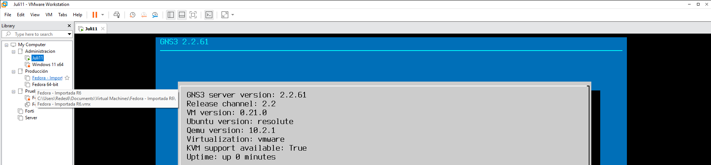
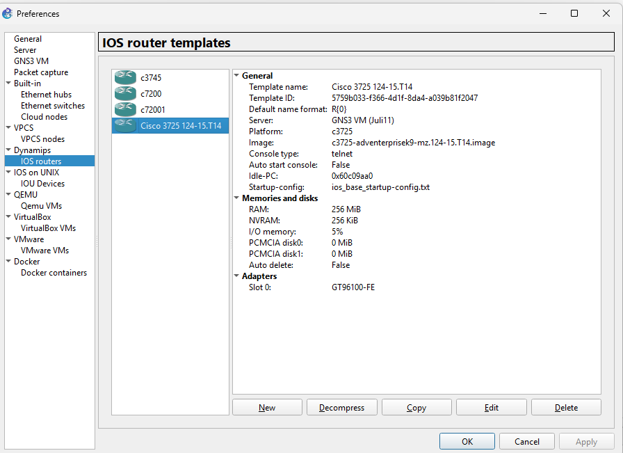
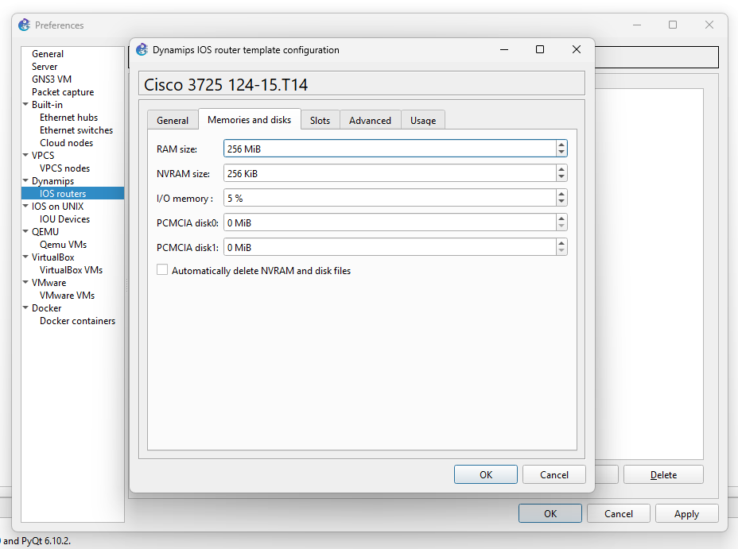
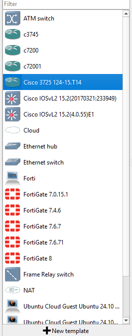
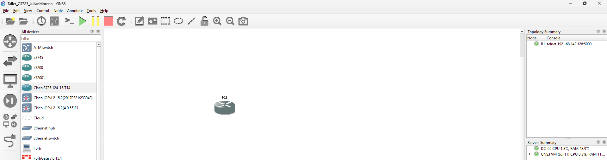
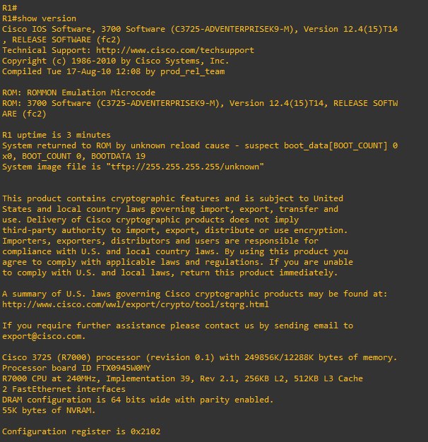
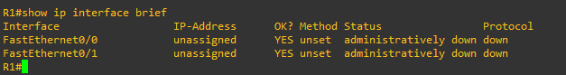

# Taller en clase: router C3725 sobre la GNS3 VM

**Estudiante:** Julián Camilo Moreno Valderrama

**Propósito:** crear un template de router C3725 que se ejecute en la **GNS3 VM** y no en el servidor local.

## 1. Verificar GNS3 y la máquina virtual

Usé GNS3 con VMware Workstation. En mi equipo, la GNS3 VM se inicia automáticamente al abrir GNS3 y el proyecto. Esperé a que estuviera conectada antes de iniciar el router.

La aplicación GNS3 y el servidor de la MV muestran la misma versión: **2.2.61**.

## 2. Crear el template C3725

1. Descargué la imagen IOS **c3725-adventerprisek9-mz.124-15.T14.image**.
2. En GNS3 entré a **Edit → Preferences → Dynamips → IOS routers → New** e importé la imagen.
3. Seleccioné la **GNS3 VM** como servidor, confirmé el modelo **c3725** y guardé el template como **Cisco 3725 124-15.T14**.

Esta captura muestra que el template quedó asociado a **GNS3 VM (Juli11)** y no al servidor local:

Configuré **256 MiB de RAM** para la imagen utilizada:

Por último, comprobé que el router apareciera en la lista de dispositivos de GNS3:

## 3. Probar el router

Creé el proyecto **Taller_C3725_JulianMoreno**, añadí el router **R1** y lo inicié. En la topología se observa el router encendido y la GNS3 VM conectada.

Abrí la consola de **R1** y ejecuté:

~~~text
R1#show version
~~~

La salida confirma **Cisco 3725** e **IOS 12.4(15)T14**.

También comprobé las interfaces:

~~~text
R1#show ip interface brief
~~~

Las dos interfaces aparecen sin dirección IP porque todavía no se ha configurado una red.

## Resultado

El template **C3725** quedó creado sobre la **GNS3 VM**. El router inició correctamente y respondió a los comandos de verificación. Con ello, la MV queda disponible para prácticas posteriores con appliances como FortiGate.
