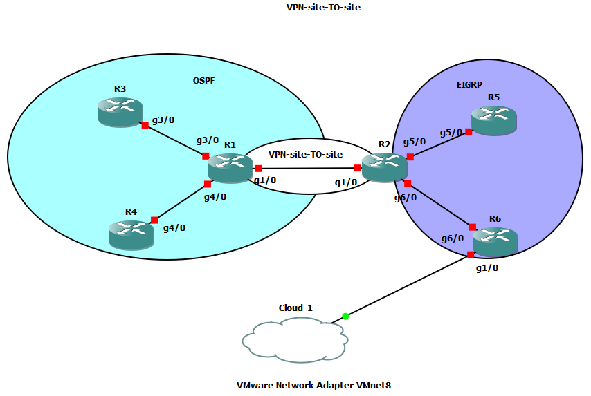

# Guía de Laboratorio: Implementación y Validación de IPsec VPN Site-to-Site Basada en Políticas (Crypto Maps) en GNS3

---

## 1. Propósito de la Práctica

El objetivo de esta práctica es diseñar, implementar, diagnosticar y verificar un túnel seguro **IPsec VPN Site-to-Site** entre dos routers de borde (**R1** y **R2**). La arquitectura interconecta dos dominios con protocolos de enrutamiento dinámico independientes (**OSPF** en el sitio izquierdo y **EIGRP** en el derecho), garantizando la confidencialidad, autenticidad e integridad del tráfico entre las redes LAN protegidas (`1.1.1.0/24` y `2.2.2.0/24`) a través de un enlace de tránsito no confiable (`12.1.1.0/24`).

---

## 2. Conceptos Clave

* **Túnel Basado en Políticas (*Policy-Based VPN*):** Método clásico de IPsec en Cisco IOS donde el tráfico a cifrar es clasificado mediante una lista de control de acceso extendida (denominada *tráfico interesante*). Si el paquete hace coincidencia con la ACL, se encapsula bajo IPsec; de lo contrario, se enruta de forma regular o se descarta.


* **Dependencia de la Tabla de Enrutamiento:** En una VPN por políticas, el router debe disponer de una ruta válida (estática o dinámica) hacia la red remota apuntando a la interfaz de salida física donde está vinculado el mapa criptográfico. Si la red remota no existe en la tabla de enrutamiento, el router descarta el paquete antes de consultar el crypto map.


* **Fase 1 (IKEv1 / ISAKMP):** Establece un canal de comunicación bidireccional seguro y autenticado entre los dos peers mediante el intercambio Diffie-Hellman y una clave precompartida (PSK). Su estado operativo óptimo es `QM_IDLE`.


* **Fase 2 (IPsec / Quick Mode):** Negocia las Asociaciones de Seguridad (SA) unidireccionales que transforman, cifran y autentican la carga útil mediante ESP (*Encapsulating Security Payload*).


* **Adaptador Host-Only / NAT (VMnet8):** Mecanismo de puente virtual provisto por VMware para interconectar nodos simulados en GNS3 con el sistema operativo anfitrión o máquinas virtuales de gestión y auditoría externa (como Kali Linux).


---

## 3. Preguntas Orientadoras para el Estudiante

1. ¿Por qué el comando `ping 2.2.2.1` ejecutado sin especificar la interfaz de origen falla al intentar levantar el túnel IPsec, aun cuando exista enrutamiento hacia esa red?


2. ¿Qué relación técnica existe entre la lista de acceso de R1 (`permit ip 1.1.1.0 ... 2.2.2.0 ...`) y la de R2 (`permit ip 2.2.2.0 ... 1.1.1.0 ...`)?


3. ¿Por qué la ausencia del comando `crypto isakmp key` impide que el router inicie el modo principal (*Main Mode*) durante el intercambio de Fase 1?


4. ¿Qué ventaja operativa representa evitar el diálogo interactivo inicial de configuración (`Setup Dialog`) en Cisco IOS frente a la configuración manual por CLI?


---

## 4. Manual de Configuración Paso a Paso.


### Topología y Direccionamiento Lógico




| Dispositivo | Interfaz | Dirección IP / Prefijo | Función / Rol |
| --- | --- | --- | --- |
| **R1** | `GigabitEthernet1/0` | `12.1.1.1/24` | Tránsito / Extremo local VPN (hacia R2)

 |
| **R1** | `Loopback0` | `1.1.1.1/24` | LAN protegida Sitio 1 (origen del túnel)

 |
| **R1** | `GigabitEthernet3/0` | `13.1.1.1/24` | Conexión interna OSPF hacia R3

 |
| **R1** | `GigabitEthernet4/0` | `14.1.1.1/24` | Conexión interna OSPF hacia R4

 |
| **R2** | `GigabitEthernet1/0` | `12.1.1.2/24` | Tránsito / Extremo remoto VPN (hacia R1)

 |
| **R2** | `Loopback0` | `2.2.2.1/24` | LAN protegida Sitio 2 (destino del túnel)

 |
| **R2** | `GigabitEthernet5/0` | `25.1.1.2/24` | Conexión interna EIGRP hacia R5

 |
| **R2** | `GigabitEthernet6/0` | `26.1.1.2/24` | Conexión interna EIGRP hacia R6

 |
---

### Preparación.

Descargar topología y IOS desde este repositorio y cargar en gns3 la IOS requerida ( se trata de la compartida en este repositorio).

https://www.telectronika.com/descargas/cisco-imagenes-ios-para-gns3-dynamips-y-vm/

---

### Análisis:

1. Túnel VPN IPsec (Sitio a Sitio)
El tráfico que viaja por el enlace g1/0 entre R1 y R2 está cifrado utilizando la tecnología IPsec. De acuerdo con el comando show run de R1, los parámetros son:
Fase 1 (ISAKMP): Política 1 usando cifrado 3DES, algoritmo de hash MD5, autenticación por clave precompartida (pre-share) con la contraseña ccie123, y el grupo Diffie-Hellman 2. El peer remoto configurado es la IP 12.1.1.2.
Fase 2 (IPsec): Utiliza un transform-set llamado SEC bajo el modo túnel con esp-3des y esp-md5-hmac.
Criptomapa: El mapa llamado R1R2 asocia la política anterior a una lista de acceso extendida (VPN).
Interés de Tráfico (ACL): La lista de acceso ip access-list extended VPN encripta exclusivamente los paquetes que viajan desde el segmento 1.1.1.0 0.0.0.255 hacia el segmento 2.2.2.0 0.0.0.255.

2. Dominio OSPF (Área 0)
El router R1 actúa como nodo central de la nube OSPF (marcada en color cian), la cual incluye a los routers vecinos R3 y R4 mediante sus respectivas interfaces g3/0 y g4/0.
Según el comando show run | sec ospf en R1:
El proceso OSPF es el ID 1.
Todas sus interfaces están añadidas en el Área 0 (Backbone). Las redes publicadas abarcan desde la 1.1.1.0 hasta la 14.1.1.0 con sus respectivas wildcard masks (0.0.0.255).

3. Dominio EIGRP e Infraestructura Externa
En el extremo derecho (área morada) se encuentra el dominio del protocolo EIGRP, gestionado por el router central R2 y conectado a los routers R5 (vía g5/0) y R6 (vía g6/0).
Conectividad Externa / Entorno Virtual: El router R6 posee una interfaz física o lógica (g1/0) conectada hacia un elemento de nube llamado Cloud-1, el cual simula una salida externa mapeada en el entorno virtual a través de la tarjeta de red VMware Network Adapter VMnet8.


---
### Paso 1: Configuración Completa del Router R1

Al encender el equipo, si el sistema solicita ingresar al diálogo de gestión inicial (`System Configuration Dialog`), se debe responder **`no`** y presionar **Enter** para ingresar al modo manual.

```text
Router> enable
Router# configure terminal
Router(config)# hostname R1
R1(config)# no ip domain-lookup

```

#### 1. Interfaces y Red Local Simulada

```text
R1(config)# interface GigabitEthernet1/0
R1(config-if)# ip address 12.1.1.1 255.255.255.0
R1(config-if)# no shutdown
R1(config-if)# exit

R1(config)# interface GigabitEthernet3/0
R1(config-if)# ip address 13.1.1.1 255.255.255.0
R1(config-if)# no shutdown
R1(config-if)# exit

R1(config)# interface GigabitEthernet4/0
R1(config-if)# ip address 14.1.1.1 255.255.255.0
R1(config-if)# no shutdown
R1(config-if)# exit

R1(config)# interface Loopback0
R1(config-if)# ip address 1.1.1.1 255.255.255.0
R1(config-if)# exit

```

#### 2. Enrutamiento Interno (OSPF) y Ruta Estática de Disparo

*Nota de diseño:* Se agrega la ruta estática hacia el segmento remoto `2.2.2.0/24` a través de R2 para que el router sepa hacia qué interfaz cursar el paquete antes de aplicarle la política IPsec.

```text
R1(config)# router ospf 1
R1(config-router)# network 1.1.1.0 0.0.0.255 area 0
R1(config-router)# network 11.11.11.0 0.0.0.255 area 0
R1(config-router)# network 12.1.1.0 0.0.0.255 area 0
R1(config-router)# network 13.1.1.0 0.0.0.255 area 0
R1(config-router)# network 14.1.1.0 0.0.0.255 area 0
R1(config-router)# exit

R1(config)# ip route 2.2.2.0 255.255.255.0 12.1.1.2

```

#### 3. Parámetros de Seguridad: Fase 1 (ISAKMP)

Se incluye la política criptográfica y la definición de la clave precompartida apuntando a R2 (`12.1.1.2`), corrigiendo la omisión de la PSK detectada en depuración:

```text
R1(config)# crypto isakmp policy 1
R1(config-isakmp)# encr 3des
R1(config-isakmp)# hash md5
R1(config-isakmp)# authentication pre-share
R1(config-isakmp)# group 2
R1(config-isakmp)# exit

R1(config)# crypto isakmp key ccie123 address 12.1.1.2

```

#### 4. Parámetros de Seguridad: Fase 2 (IPsec y Crypto Map)

```text
R1(config)# ip access-list extended VPN
R1(config-ext-nacl)# permit ip 1.1.1.0 0.0.0.255 2.2.2.0 0.0.0.255
R1(config-ext-nacl)# exit

R1(config)# crypto ipsec transform-set SEC esp-3des esp-md5-hmac
R1(cfg-crypto-trans)# mode tunnel
R1(cfg-crypto-trans)# exit

R1(config)# crypto map R1R2 10 ipsec-isakmp
R1(config-crypto-map)# set peer 12.1.1.2
R1(config-crypto-map)# set transform-set SEC
R1(config-crypto-map)# match address VPN
R1(config-crypto-map)# exit

R1(config)# interface GigabitEthernet1/0
R1(config-if)# crypto map R1R2
R1(config-if)# exit

```

#### 5. Persistencia de Configuración

```text
R1(config)# end
R1# copy running-config startup-config

```

---

### Paso 2: Configuración Completa del Router R2

En la consola de **R2**:

```text
Router> enable
Router# configure terminal
Router(config)# hostname R2
R2(config)# no ip domain-lookup

```

#### 1. Interfaces y Red Local Simulada

```text
R2(config)# interface GigabitEthernet1/0
R2(config-if)# ip address 12.1.1.2 255.255.255.0
R2(config-if)# no shutdown
R2(config-if)# exit

R2(config)# interface Loopback0
R2(config-if)# ip address 2.2.2.1 255.255.255.0
R2(config-if)# exit

```

#### 2. Enrutamiento Interno (EIGRP) y Ruta Estática de Retorno

Se agrega la ruta hacia el segmento protegido de R1 (`1.1.1.0/24`) a través del enlace de tránsito:

```text
R2(config)# router eigrp 100
R2(config-router)# network 2.2.2.0 0.0.0.255
R2(config-router)# no auto-summary
R2(config-router)# exit

R2(config)# ip route 1.1.1.0 255.255.255.0 12.1.1.1

```

#### 3. Parámetros de Seguridad: Fase 1 (ISAKMP)

```text
R2(config)# crypto isakmp policy 1
R2(config-isakmp)# encr 3des
R2(config-isakmp)# hash md5
R2(config-isakmp)# authentication pre-share
R2(config-isakmp)# group 2
R2(config-isakmp)# exit

R2(config)# crypto isakmp key ccie123 address 12.1.1.1

```

#### 4. Parámetros de Seguridad: Fase 2 (IPsec y Crypto Map)

La lista de acceso debe coincidir de forma simétrica e invertida con respecto a R1:

```text
R2(config)# ip access-list extended VPN
R2(config-ext-nacl)# permit ip 2.2.2.0 0.0.0.255 1.1.1.0 0.0.0.255
R2(config-ext-nacl)# exit

R2(config)# crypto ipsec transform-set SEC esp-3des esp-md5-hmac
R2(cfg-crypto-trans)# mode tunnel
R2(cfg-crypto-trans)# exit

R2(config)# crypto map R1R2 10 ipsec-isakmp
R2(config-crypto-map)# set peer 12.1.1.1
R2(config-crypto-map)# set transform-set SEC
R2(config-crypto-map)# match address VPN
R2(config-crypto-map)# exit

R2(config)# interface GigabitEthernet1/0
R2(config-if)# crypto map R1R2
R2(config-if)# exit

```

#### 5. Persistencia de Configuración

```text
R2(config)# end
R2# copy running-config startup-config

```

---

## 5. Protocolo de Validación y Salidas de Terminal Esperadas

### Validación 1: Conectividad Base en el Enlace de Tránsito (Underlay)

Se comprueba que ambos routers se alcancen directamente por sus IPs físicas antes de evaluar la seguridad:

```text
R1# ping 12.1.1.2
Type escape sequence to abort.
Sending 5, 100-byte ICMP Echos to 12.1.1.2, timeout is 2 seconds:
!!!!!
Success rate is 100 percent (5/5), round-trip min/avg/max = 16/24/36 ms

```

### Validación 2: Generación de Tráfico Interesante para Levantar el Túnel

El ping debe forzarse obligatoriamente con la dirección IP de origen de la red cifrada (`1.1.1.1`):

```text
R1# ping 2.2.2.1 source 1.1.1.1
Type escape sequence to abort.
Sending 5, 100-byte ICMP Echos to 2.2.2.1, timeout is 2 seconds:
Packet sent with a source address of 1.1.1.1 
.!!!!
Success rate is 80 percent (4/5), round-trip min/avg/max = 16/22/36 ms

```

*(El primer paquete con punto `.` representa el tiempo que toman los routers en negociar las SA de Fase 1 y Fase 2; los 4 restantes son confirmados con éxito `!`).*

### Validación 3: Verificación de la Asociación de Seguridad ISAKMP (Fase 1)

Se comprueba el canal de control en **R1**:

```text
R1# show crypto isakmp sa
IPv4 Crypto ISAKMP SA
dst             src             state          conn-id status
12.1.1.2        12.1.1.1        QM_IDLE           1001 ACTIVE

IPv6 Crypto ISAKMP SA

```

*(El estado `QM_IDLE` certifica que el túnel de gestión IKEv1 se encuentra completamente establecido).*

### Validación 4: Verificación de la Asociación de Seguridad IPsec (Fase 2)

Se verifica el cifrado de datos en **R1**:

```text
R1# show crypto ipsec sa
Interface: GigabitEthernet1/0
    Crypto map tag: R1R2, local addr 12.1.1.1

   protected vrf: (none)
   local  ident (addr/mask/prot/port): (1.1.1.0/255.255.255.0/0/0)
   remote ident (addr/mask/prot/port): (2.2.2.0/255.255.255.0/0/0)
   current_peer 12.1.1.2 port 500
     PERMIT, flags={origin_is_acl,}
    #pkts encaps: 4, #pkts encrypt: 4, #pkts digest: 4
    #pkts decaps: 4, #pkts decrypt: 4, #pkts verify: 4
    #pkts compressed: 0, #pkts decompressed: 0
    #pkts not compressed: 0, #pkts compr. failed: 0
    #pkts no digest: 0, #pkts no cipher: 0
    #pkts no sa: 0, #pkts invalid sa: 0
    #pkts req id: 10, #pkts encaps fail: 0

     inbound esp sas:
      spi: 0x4A2B81F2 (1244365298)
        transform: esp-3des esp-md5-hmac ,
        in use settings ={Tunnel, }
        conn id: 2001, flow_id: 1, sibling_flags 80000000, crypto map: R1R2
        sa timing: remaining key lifetime (k/sec): (4607999/3582)
        IV size: 8 bytes
        replay detection support: Y
        Status: ACTIVE

     outbound esp sas:
      spi: 0x93E410C5 (2481262789)
        transform: esp-3des esp-md5-hmac ,
        in use settings ={Tunnel, }
        conn id: 2002, flow_id: 2, sibling_flags 80000000, crypto map: R1R2
        sa timing: remaining key lifetime (k/sec): (4607999/3582)
        IV size: 8 bytes
        replay detection support: Y
        Status: ACTIVE

```

---

## 6. Cuestionario Evaluativo de la Práctica

1. **¿Por qué un comando de verificación como `ping 2.2.2.1` ejecutado de forma simple (sin `source 1.1.1.1`) no logra activar el túnel IPsec ni obtener respuesta?**
2. **Si en la salida de depuración se observa el mensaje `ISAKMP:(0):No pre-shared key with 12.1.1.2!`, ¿cuál es el impacto exacto en el proceso de establecimiento del túnel?**
3. **¿Cuál es la función específica de la ruta estática `ip route 2.2.2.0 255.255.255.0 12.1.1.2` en R1 si el tráfico entre ambas sedes ya está definido en la lista de acceso de la VPN?**
4. **Si se ejecutara una captura con Wireshark en el enlace entre R1 y R2 durante la transmisión de datos, ¿qué información de los paquetes originales sería legible y cuál quedaría oculta?**
5. **¿Qué limitación técnica impide que los paquetes de control de OSPF o EIGRP se transmitan y formen vecindades a través de este túnel IPsec configurado con Crypto Maps?**

---

## 7.

**Sustentación**

1. Desarrollar de manera individual el laboratorio.
2. Cargar desarrollo en documento pdf con evidencias y respuestas a interrogarntes.
3. Sustentación práctica en clase. 
4. Evaluación 
